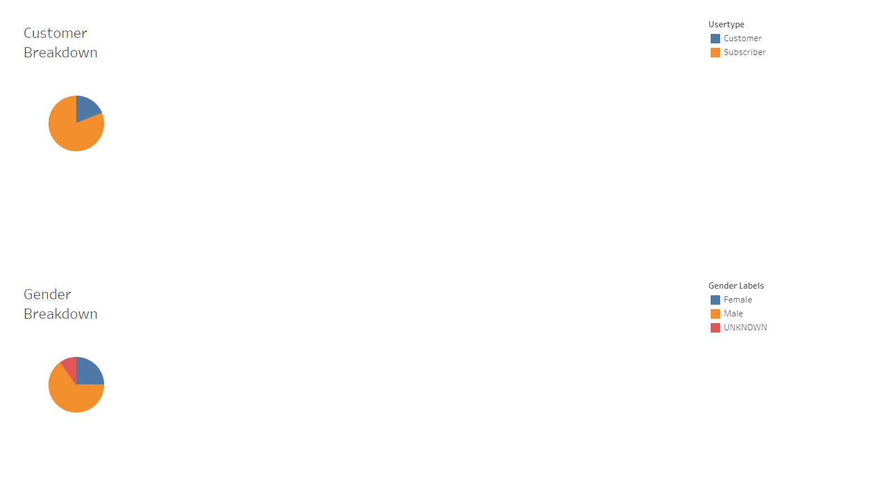
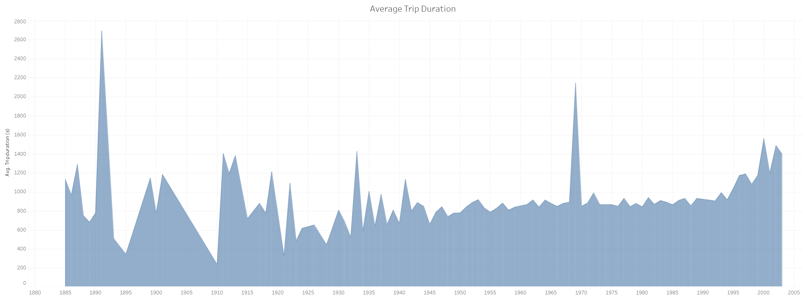
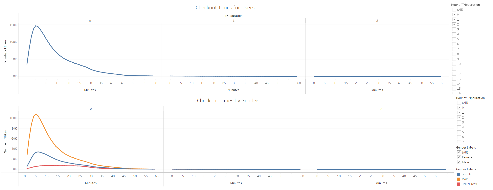
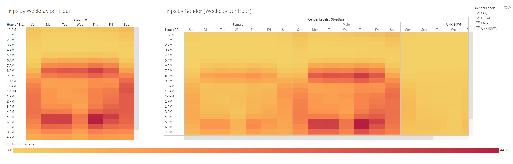
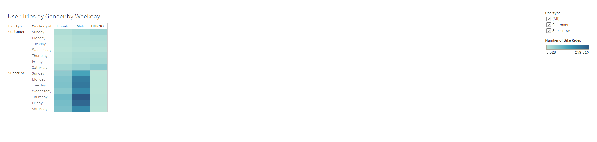

# Bike Trip Analysis

## Overview
### Purpose
Provide invenstors with data visualizaions, using Tableau, that proves that a bicycle ride sharing business in Des Moines, Iowa is a solid business proposal. Existing data from a similar business, the Citi Bike program in New York City, will be utilized to understand how the bike-sharing business actually works. In particular, this analysis will focus on how bike trips (quanity and length) relate to other factors.

 

Click [here](https://public.tableau.com/views/NYC_CitiBike_Challenge_16662044268140/BikeTripAnalysis?:language=en-US&:display_count=n&:origin=viz_share_link) to see a live view of the Dashboard.

 

## Results
Below are figures of the visualizations created, followed by a description of what information can be gleaned from each visualizaion.

 

    
    Figure 1 (Demographics Dashboard)

- Customer Breakdown
    - Over 75% of the bike trips are taken by subscribers instead of single pay customers.
- Gender Breakdown
    - The majority of the bike trip participants are male. 

 

    
    Figure 2 (Trip Duration by Age)

- Average Trip Duration
    - As individuals get younger they consistently take longer trips.

 

    
    Figure 3 (Checkout Times Dashboard)

- Checkout Times for Users
    - Most bike trips last less than an hour.
    - The most popular length for bike trips is between 5 and 10 minutes.
- Checkout Times by Gender
    - There is little to no difference in how long each gender likes to ride a bike.

 

    
    Figure 4 (Trips by Weekday per Hour Dashboard)

- Trips by Weekday per Hour
    - During the work week, the most popular times to ride a bike are in the morning (6AM-9AM) and in the afternoon (4PM-8PM)
    - Otuside of the work week, bike rides are active throughout all daylight hours of the day (7AM-8PM) with Saturday being more popular than Sunday.
- Trips by Gender (Weekday per Hour)
    - The distribution of bike rides between male and female is very similar, indicating that there is no preference difference between when either gender rides a bike.

 

    
    Figure 5 (User Trips by Gender by Weekday)

- User Trips by Gender by Weekday
    - There is little to no preference for single pay customers on when a bike ride is taken or what gender takes a bike ride.
    - For subscribers, Thursday and Friday are the most popular days to ride a bike.
 

## Summary
Based on the data anlyzed the following recommendations can be made:
- The target audience should largely be young male riders.
- The business model should focus on growing subscribers as they ride more often.
- Logistics (availability of bikes, repair frequency, etc.) should revolve around bikes being ridden for less than an hour.
- The business should capitalize on demand outside of typical work hours during the workweek and throughout daylight hours outside of the work week.

In order to make a better informed decision, the following visualizations are suggested for future analysis:
- Map visualization showing where different genders or user types (shown by color) tend to ride bikes and for how long (shown by marker size).
- Line or area visualization showing number of bike rides by birthyear.